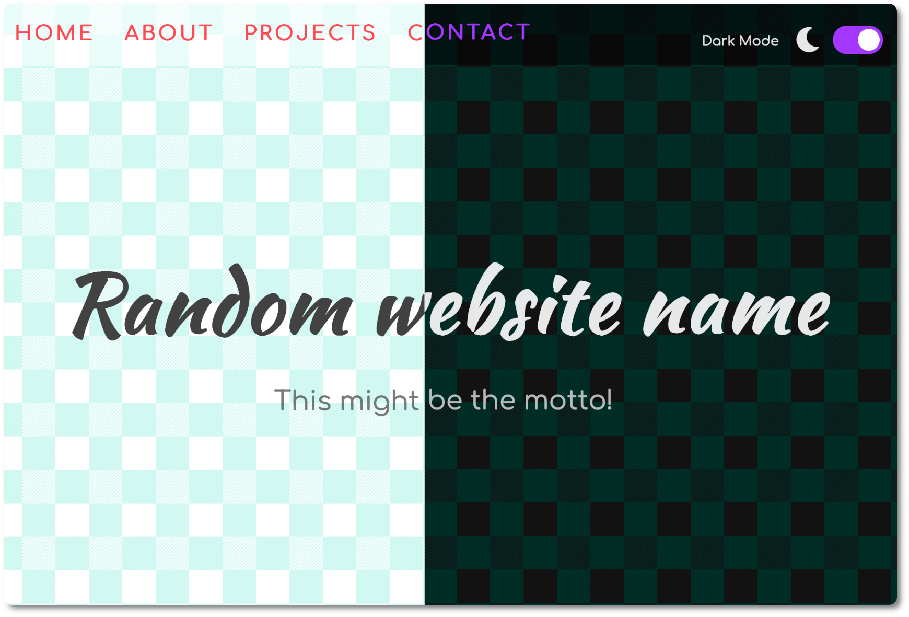

# Light & Dark Mode



%Description%

<br>

---

<br>

## Learning Outcome

<br>

1. Using CSS variables
2. `background: rgb(255 255 255 / 50%)` instead of `rgba(255, 255, 255, 0.5)`
3. Smooth scroll with `html { scroll-behavior: smooth };`
4. Creating a [toggle switch](https://www.w3schools.com/howto/howto_css_switch.asp)
5. Setting attributes on the root element (html) 
6. Using `document.documentElement` 
7. Saving theme in localStorage

<br>

---

## Process

<br>

### Creating the toggle switch

<br>

**index.html**

```html
<div class="theme-switch-wrapper">
  <!-- Text and icon -->
  <span id="toggle-icon">
  	<span class="toggle-text">Light Mode</span>
    <i class="fas fa-sun"></i>
  </span>
  <!-- Switcher -->
  <label class="theme-switch">
  	<input type="checkbox">
    <div class="slider round"></div>
  </label>
</div>
```

<br>

**style.css**

```css

```

<br>

**script.js**

<br>

Add event listener to the toggle switch. We use the change event.

```js
const toggleSwitch = document.querySelector('input[type="checkbox"]');

// Switch Theme Dynamically
//...


// Event Listener
toggleSwitch.addEventListener('change', switchTheme);
```

<br>

We create function that dynamically changes the theme

```js
// Switch Theme Dynamically
function switchTheme(event) {
  if (event.target.checked) {
    document.documentElement.setAttribute('data-theme', 'dark');
  } else {
    document.documentElement.setAttribute('data-theme', 'light');
  }
  
}
```

We use property `target.checked` to check if the switch toggle has been checked (show dark mode) or not (light mode).

1. We set the `data-theme` attribute at the highest level of the html
2. `document.documentElement` returns the...

<br>

We still need to change te icons, the text of the theme and the images. Wecreate two functions `darkMode()` and `lightMode()` to take care of this:

```js
function darkMode() {
  nav.style.backgroundColor = 'rgb(0 0 0 / 50%)';
  textBox.style.backgroundColor = 'rgb(255 255 255 / 50%)';
  // Icon text
  toggleIcon.children[0].textContent = 'Dark Mode';
  // Change icon
  toggleIcon.children[1].classList.remove('fa-sun');
  toggleIcon.children[1].classList.add('fa-moon');
  
  // Changin images
  image1.src = 'img/undraw_proud_coder_dark.svg';
  image2.src = 'img/undraw_feeling_proud_dark.svg';
  image3.src = 'img/undraw_conceptual_idea_dark.svg';
}
```

<br>

### LocalStorage

<br>

We use local storage to....

<br>

---

Background from [hero patterns](https://www.heropatterns.com/)

Illustrations from [Undraw](https://undraw.co/illustrations)

Icons from [FontAwesome](https://fontawesome.com/)


